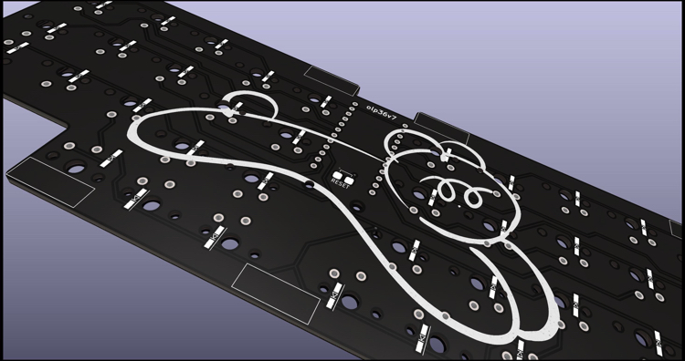

# olp36v7
以下の特徴をもったキーボードです。
* 約20cm×7cmの小さいフットプリント
* 約14mmの超ロープロファイル
* 手指の移動を極力なくした36キー
* 安定する一体型であるが分割型の使い心地
* ProMicroのコンスルー（スプリングピンヘッダ）対応
* 裏返すとかわいいクマがいる

<!-- vim-markdown-toc GFM -->

* [ビルドガイド](https://github.com/olp36/olp36v7/blob/main/docs/buildguide.md)

<!-- vim-markdown-toc -->
