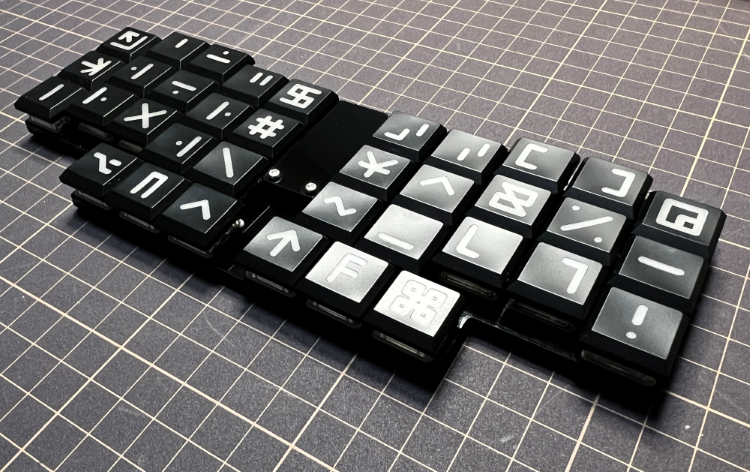

# olp36v7
olp36は、***O***rtholinear配列***L***ow-***P***rofile仕様***36***キーのキーボードシリーズです。

olp36v7は、以下の特徴をもっています。
* 約20cm×7cmの小さいフットプリント
* 約14mmの超ロープロファイル
* 手指の移動を極力なくした36キー
* 安定する一体型であるが分割型の使い心地
* ProMicroのコンスルー（スプリングピンヘッダ）対応
* 裏返すとかわいいクマがいる

<!-- vim-markdown-toc GFM -->

* [ビルドガイド](https://github.com/olp36/olp36v7/blob/main/docs/buildguide.md)
* [ファームウェア](https://github.com/olp36/qmk_firmware/tree/olp36/keyboards/olp36)
* [ファームウェアの書込](https://github.com/olp36/olp36v7/blob/main/docs/writefirmware.md)
* [キーマップ](https://github.com/olp36/olp36v7/blob/main/docs/keymaps.md)

<!-- vim-markdown-toc -->
