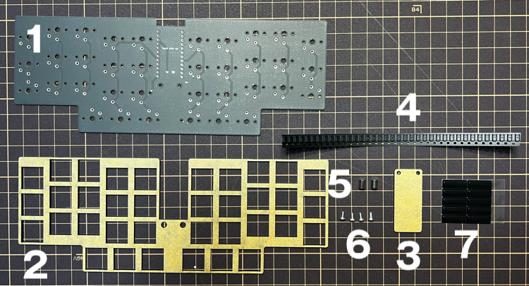
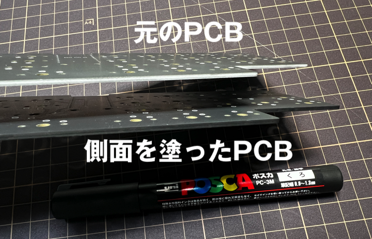

# olp36v7 ビルドガイド

olp36v7 のビルドガイドです。
（注意：v7はミドルプレート・ボトムプレートを含まない仕様のolp36です。）

## 目次

<!-- vim-markdown-toc GFM -->

* [キット同梱パーツ](#キット同梱パーツ)
* [キットとは別に必要なもの](#キットとは別に必要なもの)
* [組み立て](#組み立て)
  * [1. PCB側面を黒くする](#1-pcb側面を黒くする)
  * [2. ダイオードのはんだ付け](#2-ダイオードのはんだ付け)
  * [3. PCBにトッププレートとスイッチを取り付ける](#3-pcbにトッププレートとスイッチを取り付ける)
  * [4. スイッチのはんだ付け](#4-スイッチのはんだ付け)
  * [5. ProMicroを取り付ける](#5-promicroを取り付ける)  
    * [5.1. コンスルーで取り付ける場合](#5-1-コンスルーで取り付ける場合)
    * [5.2. ピンヘッダで取り付ける場合](#5-2-ピンヘッダで取り付ける場合)  
  * [6. 保護プレートをネジ止めする](#6-保護プレートをネジ止めする)
  * [7. ゴム足を取り付ける](#7-ゴム足を取り付ける)
  * [8. キーキャップを取り付ける](#8-キーキャップを取り付ける)
  * [9. ファームウェアを書き込む](#9-ファームウェアを書き込む)
* [最後に](#最後に)

<!-- vim-markdown-toc -->

## キット同梱パーツ

| No. | 名称 | 数量 | 備考 | 型番 |
|:---:|----|----|----|:---:|
| 1 | PCB | 1枚 | 1.6mm厚PCB（つや消し黒） | － |
| 2 | トッププレート | 1枚 | アクリル2.0mm厚（黒） | － |
| 3 | 保護プレート | 1枚 | アクリル2.0mm厚（黒） | － |
| 4 | ダイオード | 36個 + 予備 | SMDダイオード | 1N4148W |
| 5 | スペーサー | 2個 | M2 5.5mmスペーサー | ARB-2005.5E |
| 6 | ネジ | 4個 | M2 4.0mmネジ | F-0204-E |
| 7 | ゴム足 | 9個 + 予備 | 貼付けゴム足 | SJ-P1011 |

## キットとは別に必要なもの

| 名称 | 数量 | 備考 |
|----|----|----|
| Kailhロープロファイルスイッチ | 36個 | [遊舎工房](https://shop.yushakobo.jp/products/pg1350)などで購入できます。 流通性は悪いのですが、個人的にはピンクの打鍵感がお勧めです。 |
| キーキャップ | 36個 | [遊舎工房](https://shop.yushakobo.jp/products/pg1350cap-blank)などで購入できます。 レイアウトが狭いため、Kailh Chocタイプをご用意ください。 |
| ProMicro | 1個 | [遊舎工房](https://shop.yushakobo.jp/products/promicro-spring-pinheader)などで購入できます。 [Type-C版](https://shop.yushakobo.jp/products/3905)の場合は、保護プレートからはみ出す可能性があります。 |
| コンスルー or ピンヘッダ | 2枚 | [遊舎工房](https://shop.yushakobo.jp/products/31)などで購入できます。 高さ2.5mm以下のものを使用する必要があります。 |
| USBケーブル | 1個 | お使いのProMicroと適合するものを購入してください。 |

## 組み立て

### 1. PCB側面を黒くする

PCBの側面をポスカの黒などで塗ると、見た目がよくなります。

### 2. ダイオードのはんだ付け

PCBの裏面（クマのシルクが書いてある面）に、ダイオードを36個はんだ付けします。

***ダイオードの向きに注意してください。４段目中央の４つは、ダイオードの向きが他と異なります。***

1. 片側に予備はんだをします。コテの温度は320°が適正です。
2. ダイオードに印字された線と、シルクの線が同じ向きになるようにピンセットで置きます。
3. 予備はんだを溶かしてダイオードを固定します。
4. 反対側をはんだ付けします。

ダイオードのはんだ付けが終わったら、ダイオードの向きを再度確認してください。

### 3. PCBにトッププレートとスイッチを取り付ける

PCBの上にトッププレートを置き、さらに上からスイッチを36個取り付けます。

トッププレートのスイッチ穴は遊びが少ないため、
スイッチの足が折れないよう気を付けて取り付けてください。

***スイッチの向きに注意してください。３段目両端と４段目全部は、スイッチの向きが他と異なります。***

### 4. スイッチのはんだ付け

PCBの裏面から、すべてのスイッチの足を２箇所ずつはんだ付けします。

しっかりとスイッチがPCBと接地していることを、
はんだ付け前に１つずつ確認しながら作業してください。

### 5. ProMicroを取り付ける

#### 5.1. コンスルーで取り付ける場合

コンスルー（スプリングピンヘッダ）に対応しているため、コンスルー付きのProMicroであれば、
はんだ付けなしに表面からPCBに取り付けることができます。

***ProMicroの向きに注意してください。ProMicroの裏面が表になるように配置します。***

1. ProMicroの裏面（平らな方）が上になるように、下からコンスルーをはんだ付けします。
2. 表面から、PCBのスルーホールに挿入します。

コンスルーには、推奨される向きがあります。
コンスルー側面の小さい窓がProMicro方向になるようにしてください。
また、小さい窓が同じ方向を向くようにします。

#### 5.2. ピンヘッダで取り付ける場合

ProMicroとピンヘッダをPCBにはんだ付けすることで、固定して使用することができます。

***ProMicroの向きに注意してください。ProMicroの裏面が表になるように配置します。***

1. 表面から、PCBのスルーホールにピンヘッダを挿入します。
2. ProMicroの裏面（平らな方）が上になるように、ピンヘッダに挿入します。
3. ProMicroとピンヘッダをはんだ付けします。

### 6. 保護プレートをネジ止めする

PCBと保護プレートを、スペーサーとネジを使って固定します。

1. 保護プレートとスペーサーを２箇所ネジ止めします。
2. PCBの裏面からスペーサーを２箇所ネジ止めします。

### 7. ゴム足を取り付ける

PCBの裏面に、ゴム足を９個貼り付けます。

### 8. キーキャップを取り付ける

スイッチに、Kailh Chocタイプのキーキャップを36個取り付けます。

[遊舎工房のキーキャップ印字サービス](https://yushakobo.jp/keycapprinting/)では、
Kailh Chocタイプのキーキャップがちょうど36個印字または刻印することができます。

### 9. ファームウェアを書き込む

PCとUSBケーブルで接続し、QMKを使用してファームウェアを書き込みます。
キーマップは、Mac用（default）とWindows用のものを用意しています。
[olp36/qmk_firmware](https://github.com/olp36/qmk_firmware/tree/olp36/)  `olp36` ブランチの `keyboards/olp36` にファームウェアがあります。

リセットは、裏面の２箇所を短絡させることで行うことができます。

## 最後に

お疲れ様でした。これで完成です。

すべてのキーが正常に動作することをご確認ください。

ご愛用いただけますと幸いです。
